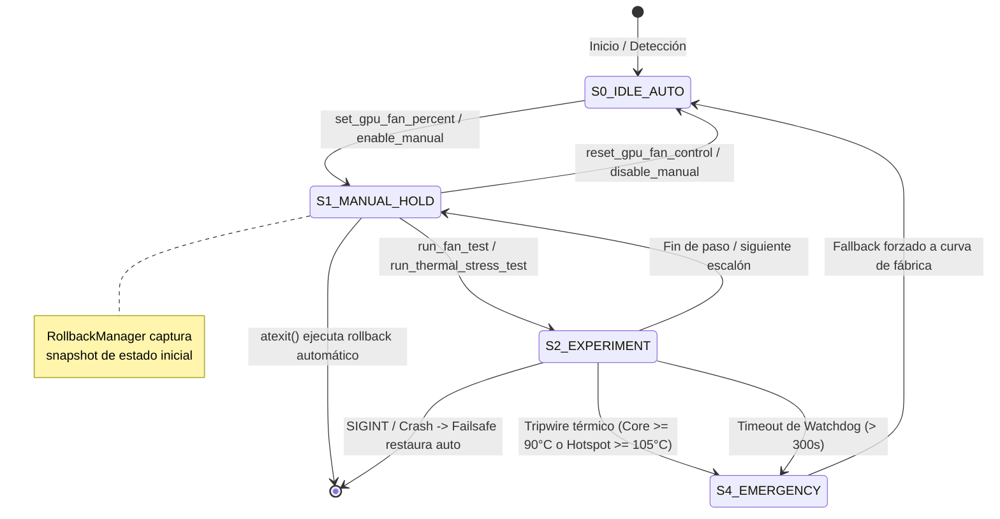

# hwctl: Especificación de Articulaciones y Sensores de Hardware para Agente IA (Antigravity)

**Identificador de Protocolo:** `hwctl-agent-v1`  
**Destinatario:** Agente de Inteligencia Artificial Externo (`Antigravity`)  
**Naturaleza:** Interfaz Determinista de Percepción y Actuación sobre Hardware de Computadora (Windows / Linux)  
**Objetivo de Hardware:** Arquitecturas de GPU AMD Radeon (con enfoque en Polaris 10/20 / RX 580) y extensibilidad para NVIDIA e Intel.

---

## 1. Modelo Operativo y Filosofía de Agente

Este software constituye el **aparato sensomotor** de Antigravity. No contiene lógica deliberativa, árboles de decisión heurísticos ni motores de inferencia. La división de responsabilidades es estricta:

```text
┌────────────────────────────────────────────────────────────────────────┐
│                   ANTIGRAVITY (AGENTE COGNITIVO)                       │
│  - Formulación de hipótesis (ej: "ventilador atascado vs VBIOS")       │
│  - Selección y secuenciación de experimentos                           │
│  - Inferencia bayesiana y correlación de deltas térmicos/RPM           │
│  - Decisión de mitigación o solicitud de intervención humana           │
└───────────────────────────────────┬────────────────────────────────────┘
                                    │ CLI / JSON (stdin/stdout)
                                    ▼
┌────────────────────────────────────────────────────────────────────────┐
│                      HWCTL (CONTROLADOR SENSOMOTOR)                    │
│  - Percepción: Sensores físicos, buses I2C/SMBus, registros ADL/sysfs  │
│  - Actuación: Ciclos de trabajo PWM, escalones térmicos, compute load  │
│  - Seguridad: Invariantes físicas, timeouts, watchdog, rollback atexit │
│  - Determinismo: Salida 100% JSON en stdout; errores tipados con código│
└────────────────────────────────────────────────────────────────────────┘
```

---

## 2. Topología Física y Canales de Hardware (AMD Polaris / RX 580)

Para que Antigravity pueda razonar con precisión sobre la física del dispositivo, debe comprender la cadena de control subyacente:

```text
                                  ┌───────────────────────┐
                                  │      Antigravity      │
                                  └───────────┬───────────┘
                                              │ hwctl
                                              ▼
                        ┌───────────────────────────────────────────┐
                        │      Capa de Abstracción de Driver        │
                        │  - Windows: atiadlxx.dll (Overdrive5/N)   │
                        │  - Linux: amdgpu driver (sysfs / hwmon)   │
                        └─────────────────────┬─────────────────────┘
                                              │
                      ┌───────────────────────┴───────────────────────┐
                      ▼                                               ▼
         ┌─────────────────────────┐                     ┌─────────────────────────┐
         │     PowerPlay Table     │                     │ SMC (System Management  │
         │ (VBIOS ROM / PPTables)  │                     │       Controller)       │
         └────────────┬────────────┘                     └────────────┬────────────┘
                      │ Curvas fijas / min_pwm                        │
                      └───────────────────────┬───────────────────────┘
                                              │ Registro PWM (0-255 / 0-100%)
                                              ▼
                             ┌─────────────────────────────────┐
                             │ Conector del Cooler (4 Pines)   │
                             ├─────────────────────────────────┤
                             │ Pin 1: GND                      │
                             │ Pin 2: 12V DC                   │
                             │ Pin 3: TACH (Sensor Hall / RPM) │ ──► hwctl: fan.rpm
                             │ Pin 4: PWM (Control de pulsos)  │ ◄── hwctl: set_fan_percent
                             └─────────────────────────────────┘
```

### Discrepancia entre `reported_percent` y `reported_rpm`
* `reported_percent`: Refleja el **registro lógico de ciclo de trabajo** escrito en el controlador PWM.
* `reported_rpm`: Refleja la **frecuencia de pulsos del sensor de efecto Hall** en el motor del ventilador leída por el tacómetro del SMC.
* **Inferencia para Antigravity**: Si `reported_percent` varía de 25% a 100% pero `reported_rpm` permanece estático (ej: `1127 RPM` constante) o en `0 RPM`, el fallo **no es del software ni del driver**, sino:
  1. Cable de señal PWM cortado o desprendido en el cabezal de 4 pines.
  2. Circuito integrado controlador PWM del PCB quemado.
  3. Bloqueo mecánico / rodamiento del ventilador trabado.
  4. VBIOS modificado (típico de minería) con tablas PowerPlay que ignoran escrituras al registro dinámico.

---

## 3. Matriz de Estados y Ciclo de Vida de Ejecución

`hwctl` implementa una máquina de estados finita con garantías de rollback:



---

## 4. Percepción: Sensores y Telemetría

### 4.1 `get_gpu_sensors`
* **Tipo:** Sensor de Telemetría Dinámica.
* **Frecuencia Máxima de Muestreo Recomendada:** 1 Hz a 10 Hz (evitar saturación de bus I2C).
* **Canales de Medición:**

| Sensor | Campo JSON | Tipo | Unidad | Origen de Hardware |
| :--- | :--- | :--- | :--- | :--- |
| Temperatura Núcleo | `temperature_c` | `float` | °C | Diodo térmico de silicio en el die de la GPU. |
| Temperatura Hotspot | `hotspot_c` | `float` | °C | Punto más caliente entre matriz de diodos (Junction). |
| Velocidad Física | `fan.rpm` | `int` | RPM | Tacómetro de pulsos (Pin 3 del conector del cooler). |
| Porcentaje Actual | `fan.current_percent` | `float` | % | Ciclo de trabajo PWM actual reportado por driver. |
| Porcentaje Objetivo | `fan.target_percent` | `float` | % | Valor de PWM objetivo configurado en el registro. |
| Modo de Operación | `fan.control_mode` | `string` | enum | `"auto"` (firmware/driver) o `"manual"` (usuario/agente). |
| Potencia Consumida | `power_w` | `float` | Watts | Sensor shunt de corriente / estimador telemetría SMC. |
| Carga de Trabajo | `usage_percent` | `float` | % | Actividad de los Compute Units / Shaders. |
| Reloj de Núcleo | `core_clock_mhz` | `float` | MHz | Frecuencia DPM activa del GPU Core. |
| Reloj de Memoria | `memory_clock_mhz`| `float` | MHz | Frecuencia DPM activa del controlador VRAM. |
| Voltaje Núcleo | `voltage_mv` | `float` | mV | Telemetría VRM (VDDC). |

### 4.2 `check_environment`
* **Tipo:** Sensor de Estado Operacional del Sistema Anfitrión.
* **Propósito:** Evalúa si el agente dispone de los privilegios y módulos de kernel para actuar.
* **Contrato de Salida:**
```json
{
  "success": true,
  "action": "check_environment",
  "data": {
    "is_admin": true,
    "adl_available": false,
    "opencl_available": true,
    "active_gpu_vendor": "AMD",
    "conflicting_processes": ["corectrl"],
    "notes": [
      "Detected OS: Arch Linux (Kernel 6.12.1-arch1-1).",
      "Arch Linux detected: provides maximum freedom via direct sysfs/hwmon nodes and dmesg.",
      "Running as root (UID 0): direct PWM writing and hardware overrides are fully authorized."
    ]
  }
}
```

---

## 5. Actuación: Modificación de Registros y Controladores

### 5.1 `set_gpu_fan_percent`
* **Tipo:** Actuador de Ciclo de Trabajo PWM.
* **Precondiciones:**
  * Privilegios de Administrador (Windows) o `root` (Linux).
  * Valor de porcentaje en rango cerrado `[0.0, 100.0]`.
* **Invariantes y Efectos Secundarios:**
  * Se registra un snapshot previo en el `RollbackManager`.
  * En Windows: Se invoca `ADL_Overdrive5_FanSpeed_Set`.
  * En Linux: Se escribe `1` en `pwm1_enable` y `round(pct * 255 / 100)` en `pwm1`.
  * Se realiza una lectura inmediata posterior para reportar `reported_percent` y `reported_rpm`.
* **Contrato de Salida:**
```json
{
  "success": true,
  "action": "set_gpu_fan_percent",
  "timestamp": "2026-10-08T22:45:00.000000+00:00",
  "requested_percent": 80.0,
  "reported_percent": 80.0,
  "reported_rpm": 1127,
  "temperature_c": 62.0,
  "power_w": 45.0
}
```

### 5.2 `reset_gpu_fan_control`
* **Tipo:** Actuador de Failsafe / Restauración.
* **Efecto:**
  * Elimina cualquier bloqueo de velocidad fija.
  * Restaura el bit de control a modo automático (`pwm1_enable = 2` en Linux / default en ADL).
  * Limpia el registro del `RollbackManager`.

---

## 6. Experimentos Controlados y Generación de Carga

Antigravity puede orquestar pruebas estáticas y dinámicas directamente sin requerir aplicaciones gráficas externas.

### 6.1 `run_fan_test` (Prueba Estática Escalonada)
* **Objetivo para el Agente:** Determinar la curva de respuesta PWM vs. RPM en condiciones de reposo.
* **Parámetros:**
  * `--steps`: Lista separada por comas (ej: `25,50,75,100`).
  * `--hold`: Segundos de permanencia por escalón (ej: `3.0`).
  * `--interval`: Frecuencia de muestreo durante la permanencia (ej: `1.0`).
* **Comportamiento Failsafe:** Al concluir el último escalón (o si ocurre un error), **restablece automáticamente el control original**.

### 6.2 `run_thermal_stress_test` (Prueba Dinámica con Carga)
* **Objetivo para el Agente:** Evaluar si el cooler disipa calor bajo carga térmica real y si el firmware eleva el ventilador de forma autónoma.
* **Mecanismo de Generación de Carga:** Compila y despacha un kernel OpenCL nativo directo a los Shaders/CUs de la GPU, elevando el uso a ~99% y el consumo a potencia nominal TDP (~145W-185W en RX 580).
* **Tripwire Térmico Autónomo:**
  * Si `temperature_c >= emergency_temp` (default `90.0°C`) o `hotspot_c >= emergency_hotspot` (default `105.0°C`):
  * La carga de cómputo se interrumpe en milisegundos.
  * Se aborta la prueba con `aborted_by_safety: true` y `abort_reason: "CORE_TEMP_TRIP"`.
  * Se restablece la ventilación.
* **Esquema de Salida:**
```json
{
  "success": true,
  "action": "run_thermal_stress_test",
  "data": {
    "success": true,
    "duration_seconds": 15.0,
    "aborted_by_safety": false,
    "abort_reason": null,
    "initial_temperature": 52.0,
    "peak_temperature": 84.5,
    "final_temperature": 56.0,
    "initial_rpm": 1127,
    "peak_rpm": 1127,
    "final_rpm": 1127,
    "samples": [
      {
        "elapsed_seconds": 1.0,
        "temperature_c": 58.0,
        "hotspot_c": 70.0,
        "rpm": 1127,
        "fan_percent": 85.0,
        "usage_percent": 99.0,
        "power_w": 145.0
      }
    ]
  }
}
```

---

## 7. Árbol de Correlación Diagnóstica para Antigravity

La siguiente tabla resume cómo Antigravity debe relacionar las lecturas de `hwctl` con las hipótesis de falla física:

| `target_percent` | `reported_percent` | `reported_rpm` | `temperature_c` | Diagnóstico Deductivo de Antigravity |
| :---: | :---: | :---: | :---: | :--- |
| `100%` | `100%` | `~1127` (fijo) | Creciendo | **Falla de hardware:** Conector PWM de 4 pines cortado, pin de tacómetro flotante, o VBIOS de minería con tabla estática fija. |
| `100%` | `100%` | `0` | Creciendo | **Falla mecánica/física:** Ventiladores trabados mecánicamente, cable desconectado o bobina quemada. |
| `100%` | `< 50%` | Coincide | Creciendo | **Conflicto de software:** Herramienta de terceros (Afterburner / CoreCtrl) sobreescribiendo el registro continuamente. |
| `100%` | `100%` | `> 2800` | `> 85°C` (muy alta) | **Falla de disipación térmica:** Ventiladores operan a pleno pero la pasta térmica está degradada (pump-out) o heatpipes pinchados. |
| `< 40%` | `< 40%` | `0` | `< 50°C` | **Comportamiento normal:** Modo Zero-RPM activo por firmware (ventiladores apagados en reposo). |

---

## 8. Formato de Invocación e Integración de Procesos

Antigravity interactúa con `hwctl` mediante llamadas de consola deterministas.

### Convenciones de Entrada/Salida
1. **stdout:** Contiene **únicamente** la estructura JSON de la respuesta.
2. **stderr:** Reservado para mensajes de depuración, trazas o advertencias de fallback. Nunca se mezcla con la salida JSON.
3. **Exit Code:**
   * `0`: Acción ejecutada con éxito (`success: true`).
   * `1`: Fallo de validación, violación de seguridad o error de hardware (`success: false`).

### Matriz de Códigos de Error (`HwctlError`)

| Código | Significado | Acción Sugerida para Antigravity |
| :--- | :--- | :--- |
| `PERMISSION_DENIED` | Operación requiere permisos de Administrador o root. | Solicitar al usuario elevar el proceso o ejecutar con `sudo`. |
| `SAFETY_VIOLATION` | Parámetro fuera de los límites de seguridad física. | Ajustar el parámetro a rango seguro (ej: clamps `[0, 100]`). |
| `FAN_CONTROL_UNAVAILABLE` | Driver o GPU no exponen interfaz de escritura. | Concluir que el driver bloquea Overdrive o verificar VBIOS. |
| `ACTION_TIMEOUT` | La operación excedió el tiempo máximo estipulado. | Abortar el paso y verificar telemetría actual. |
| `DRIVER_ERROR` | Error interno de la biblioteca ADL o del módulo amdgpu. | Consultar `get-kernel-logs` (Linux) o verificar estado del driver. |
| `HARDWARE_NOT_FOUND` | No se detectó adaptador AMD compatible activo. | Comprobar conexión PCI Express o utilizar `--provider mock`. |

---

## 9. Registro de Auditoría Persistente (`logs/audit_hwctl.jsonl`)

Cada intervención, lectura y cambio de estado se anota secuencialmente en formato **JSON Lines** en `logs/audit_hwctl.jsonl`:

```json
{"timestamp": "2026-10-08T22:50:01.100Z", "event_type": "safety_intervention", "tool": "rollback_manager.capture_state", "parameters": {"captured_state": {"fan": {"target_percent": 40.0, "rpm": 1127, "control_mode": "auto"}}}}
{"timestamp": "2026-10-08T22:50:01.150Z", "event_type": "action", "tool": "set_gpu_fan_percent", "parameters": {"requested_percent": 100.0}, "before_state": {"reported_percent": 40.0}, "after_state": {"reported_percent": 100.0, "reported_rpm": 1127}, "result": {"success": true}}
{"timestamp": "2026-10-08T22:50:06.200Z", "event_type": "safety_intervention", "tool": "rollback_manager.execute_rollback", "result": {"success": true}}
```

Este log permite que Antigravity o el usuario reconstruyan retrospectivamente la línea temporal exacta de cualquier investigación.

---

## 10. Validación de Integridad (Suite Automatizada)

Para verificar que todos los contratos sensomotores, validaciones de seguridad y abstracciones de plataforma funcionan correctamente:

```bash
python -m unittest discover tests
```

*Total de pruebas unitarias:* **25 tests automatizados** cubriendo modelos, clamps de seguridad, watchdog, simulación de ventiladores clavados, carga OpenCL y compatibilidad con Linux/Arch.
