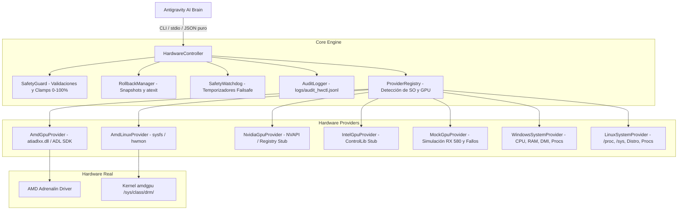

# hwctl (Hardware Control & Diagnostic Layer)

[](https://www.python.org/downloads/)
[](https://github.com/aquinoalejandro/hwctl-for-agy)
[](LICENSE)
[](tests/)

**hwctl** es la capa física de herramientas, telemetría y control de hardware diseñada para ser operada por el agente de IA **Antigravity**. Actúa como los **ojos y manos** del agente en el sistema operativo, permitiéndole interactuar de forma segura con la GPU y el equipo sin tomar decisiones diagnósticas por su cuenta.

---

## 📌 Tabla de Contenidos
1. [Filosofía y Separación de Responsabilidades](#-filosofía-y-separación-de-responsabilidades)
2. [Arquitectura del Sistema](#-arquitectura-del-sistema)
3. [Diferencias por Plataforma (Windows vs Linux / Arch)](#-diferencias-por-plataforma-windows-vs-linux--arch)
4. [Instalación y Requisitos](#-instalación-y-requisitos)
5. [Catálogo Completo de Herramientas CLI](#-catálogo-completo-de-herramientas-cli)
6. [Contratos y Esquemas JSON](#-contratos-y-esquemas-json)
7. [Mecanismos de Seguridad y Rollback](#-mecanismos-de-seguridad-y-rollback)
8. [Modo de Simulación y Laboratorio (Mock)](#-modo-de-simulación-y-laboratorio-mock)
9. [Flujo de Diagnóstico Típico para Antigravity](#-flujo-de-diagnóstico-típico-para-antigravity)
10. [Ejecución de Pruebas Automatizadas](#-ejecución-de-pruebas-automatizadas)
11. [Estructura del Proyecto](#-estructura-del-proyecto)

---

## 🧠 Filosofía y Separación de Responsabilidades

> [!IMPORTANT]
> **El software NO contiene un agente de IA ni toma decisiones autónomas.**
> * **Antigravity** es el **Cerebro**: analiza datos, formula hipótesis, decide qué pruebas correr, interpreta los resultados y propone soluciones.
> * **hwctl** es el **Cuerpo**: observa el estado físico, ejecuta únicamente acciones explícitas y seguras, y devuelve telemetría estructurada y determinista.
>
> **Regla de oro**: El código de `hwctl` jamás contendrá heurísticas como `if temp > 90: fan_up()` ni emitirá veredictos como *"la GPU está fallando"*. Su única tarea es: **Observar → Ejecutar con seguridad → Reportar datos puros**.

---

## 🏗 Arquitectura del Sistema

El sistema está diseñado en capas desacopladas mediante el patrón *Provider*, garantizando extensibilidad futura hacia NVIDIA e Intel sin acoplar la lógica a una GPU específica.



---

## 🐧 Diferencias por Plataforma (Windows vs Linux / Arch)

`hwctl` detecta automáticamente el sistema operativo y activa el backend óptimo:

| Característica | Windows 10 / 11 | Arch Linux / Linux |
| :--- | :--- | :--- |
| **Driver Interface** | AMD Display Library (`atiadlxx.dll`) | Kernel `amdgpu` driver vía `sysfs` / `hwmon` |
| **Control de Ventilador** | Overdrive 5 / OverdriveN C-API | Escritura directa a `/sys/class/drm/card*/device/hwmon/hwmon*/pwm1` |
| **Lectura de Tacómetro** | Llamadas ADL (`ADL_Overdrive5_FanSpeed_Get`) | Lectura directa de `fan1_input` (RPM en tiempo real) |
| **Permisos Requeridos** | Consola con Administrador (UAC) | Permisos `root` / `sudo` (UID 0) |
| **Diagnóstico de Driver** | Códigos de error numéricos de ADL | Buffer del kernel (`dmesg`) con fallos de SMC / I2C / PWM |
| **OverDrive / Voltajes** | Sujeto a firmas de driver Adrenalin | Desbloqueo total vía parámetro `amdgpu.ppfeaturemask=0xffffffff` |
| **Dependencia GUI** | **Ninguna** (No requiere abrir Adrenalin ni Afterburner) | **Ninguna** (No requiere X11, Wayland ni CoreCtrl) |

---

## 🚀 Instalación y Requisitos

### Requisitos Previos
* **Python**: 3.10 o superior (con `ctypes` y `psutil`).
* **En Windows**:
  * Driver de video AMD instalado (para disponer de `C:\Windows\System32\atiadlxx.dll`).
  * Ejecutar el terminal como **Administrador** si se desea enviar comandos de escritura de ventiladores.
* **En Linux (Arch, Fedora, Ubuntu, etc.)**:
  * Driver `amdgpu` activo en el kernel.
  * Ejecutar como `root` o con `sudo` para escribir en los nodos de `/sys/class/drm/`.

### Instalación Local
```powershell
# Clonar el repositorio
git clone https://github.com/aquinoalejandro/hwctl-for-agy.git
cd hwctl-for-agy

# Instalar dependencias
pip install -e .
```

---

## 🛠 Catálogo Completo de Herramientas CLI

Todos los comandos devuelven **exclusivamente JSON formateado a `stdout`**, garantizando que Antigravity pueda consumirlos directamente mediante su ejecutor de comandos (`run_command` / `subprocess`).

### 1. Diagnóstico de Entorno y Sistema

| Comando | Argumentos | Descripción |
| :--- | :--- | :--- |
| `describe-tools` | Ninguno | Devuelve el catálogo completo en formato JSON con la firma de cada herramienta para Antigravity. |
| `check-environment` | Ninguno | Verifica elevación (Admin/root), DLLs de AMD o nodos `sysfs`, disponibilidad de OpenCL y procesos en conflicto. |
| `get-system-info` | Ninguno | Devuelve SO (distro exacta o build de Windows), CPU, cores, RAM disponible, placa madre y procesos relevantes. |
| `get-kernel-logs` | `[--lines 50]` | *(Linux/Arch)* Filtra las últimas líneas de `dmesg` correspondientes al driver `amdgpu` (alertas de SMC, firmware y microcódigo). |

### 2. Telemetría y Consulta de GPU (Lectura Pura)

| Comando | Argumentos | Descripción |
| :--- | :--- | :--- |
| `get-gpu-info` | `[--adapter 0]` | Modelo exacto, fabricante, VRAM, versión del driver y VBIOS/ROM. |
| `get-gpu-sensors` | `[--adapter 0]` | Lectura en tiempo real de temperatura núcleo, hotspot, RPM, Watts, voltajes y MHz de reloj. |
| `get-gpu-fan-status` | `[--adapter 0]` | Porcentaje objetivo/actual, RPM reportado, modo (`auto`/`manual`) y límites min/max. |
| `get-gpu-driver-info`| `[--adapter 0]` | Estado de inicialización del driver y número de adaptadores activos. |
| `get-gpu-vbios-info` | `[--adapter 0]` | Versión, fecha y número de parte del firmware VBIOS. |

### 3. Control de Hardware (Mutaciones Seguras)

| Comando | Argumentos | Descripción |
| :--- | :--- | :--- |
| `set-gpu-fan-percent` | `--percent <0-100>` | Fija el ventilador a un porcentaje. Valida límites, guarda snapshot previo para rollback y lee telemetría resultante. |
| `enable-gpu-manual-fan-control` | `[--adapter 0]` | Fija el controlador en modo manual, manteniendo las RPM actuales como punto de partida. |
| `disable-gpu-manual-fan-control`| `[--adapter 0]` | Restablece el control automático por firmware/driver. |
| `reset-gpu-fan-control` | `[--adapter 0]` | **Failsafe**: Restaura de inmediato la curva automática por defecto del controlador. |

### 4. Experimentos Controlados y Carga (Sin FurMark ni juegos)

| Comando | Argumentos | Descripción |
| :--- | :--- | :--- |
| `run-fan-test` | `--steps 25,50,75,100`<br>`--hold 5`<br>`--interval 1` | Ejecuta una secuencia de escalones de ventilador, muestrea RPM y temperaturas en cada paso y **restaura automáticamente el estado inicial**. |
| `start-gpu-stress` | `[--duration 30]` | Inicia una carga continua de cómputo en la GPU (OpenCL nativo) en segundo plano con auto-timeout de seguridad. |
| `stop-gpu-stress` | Ninguno | Detiene inmediatamente cualquier carga activa de cómputo. |
| `run-thermal-stress-test` | `--duration 20`<br>`--interval 1`<br>`--emergency-temp 90` | Aplica carga de GPU mientras toma muestras por segundo. **Cuenta con tripwire térmico**: si la temperatura toca el límite de emergencia, corta la carga al instante. |
| `create-diagnostic-snapshot` | `[--adapter 0]` | Captura un snapshot atómico sincronizado de Sistema + GPU + Sensores + Procesos. |
| `create-diagnostic-report` | `[--output <ruta>]` | Guarda el snapshot atómico en un archivo `.json` en disco para auditoría histórica. |

---

## 📋 Contratos y Esquemas JSON

### 1. Respuesta de Telemetría en Tiempo Real (`get-gpu-sensors`)
```json
{
  "success": true,
  "action": "get_gpu_sensors",
  "timestamp": "2026-10-08T22:40:15.123456+00:00",
  "data": {
    "temperature_c": 54.0,
    "hotspot_c": 66.8,
    "usage_percent": 12.0,
    "vram_usage_percent": 22.5,
    "vram_used_mb": 1843.0,
    "power_w": 38.5,
    "core_clock_mhz": 1340.0,
    "memory_clock_mhz": 2000.0,
    "voltage_mv": 1150.0,
    "fan": {
      "target_percent": 45.0,
      "current_percent": 45.0,
      "rpm": 1450,
      "control_mode": "auto",
      "min_percent": 0.0,
      "max_percent": 100.0,
      "min_rpm": 0,
      "max_rpm": 3200
    }
  }
}
```

### 2. Respuesta de Verificación de Acción (`set-gpu-fan-percent`)
Permite a Antigravity contrastar lo solicitado contra lo efectivamente reportado por el hardware:
```json
{
  "success": true,
  "action": "set_gpu_fan_percent",
  "timestamp": "2026-10-08T22:41:00.654321+00:00",
  "requested_percent": 80.0,
  "reported_percent": 80.0,
  "reported_rpm": 2680,
  "temperature_c": 51.5,
  "power_w": 40.2
}
```

### 3. Respuesta de Error Estructurado
```json
{
  "success": false,
  "action": "set_gpu_fan_percent",
  "error": {
    "code": "SAFETY_VIOLATION",
    "message": "Requested fan speed 120.0% is out of safe range [0.0, 100.0]."
  },
  "timestamp": "2026-10-08T22:42:10.000000+00:00"
}
```

### 4. Diagnóstico de Entorno (`check-environment`)
```json
{
  "success": true,
  "action": "check_environment",
  "timestamp": "2026-10-08T22:43:00.000000+00:00",
  "data": {
    "is_admin": true,
    "adl_available": true,
    "opencl_available": true,
    "active_gpu_vendor": "AMD",
    "conflicting_processes": ["MSIAfterburner.exe"],
    "notes": [
      "Detected OS: Windows.",
      "Detected hardware tuning tools running: MSIAfterburner.exe. They may overwrite manual fan settings."
    ]
  }
}
```

---

## 🛡 Mecanismos de Seguridad y Rollback

Para evitar que la GPU quede desprotegida o sufra daño térmico durante los experimentos de Antigravity:

1. **Clamping Estricto [0, 100]%**: `SafetyGuard.validate_fan_percent()` rechaza cualquier valor fuera de rango antes de interactuar con el driver.
2. **Snapshot de Estado Previo**: `RollbackManager` captura el estado original del ventilador antes de aplicar cualquier mutación reversible.
3. **Restauración en `atexit`**: Si el proceso se interrumpe, se cierra la consola o se produce una excepción no controlada, el manejador de salida de Python ejecuta inmediatamente `reset_gpu_fan_control()`.
4. **Watchdog de Timeout**: Un hilo en segundo plano cancelable garantiza que ninguna prueba manual pueda dejar a la GPU desatendida por más tiempo del estipulado (máximo 5 minutos).
5. **Tripwire Térmico de Emergencia**: Durante `run_thermal_stress_test`, si el núcleo alcanza 90 °C o el hotspot alcanza 105 °C, la carga de cómputo **se cancela inmediatamente** y se restablece la refrigeración completa.
6. **Auditoría en JSONL**: Cada orden, parámetro, estado anterior, estado posterior y resultado se escribe secuencialmente en `logs/audit_hwctl.jsonl`.

---

## 🧪 Modo de Simulación y Laboratorio (Mock)

Si no se cuenta con una GPU AMD física conectada en el momento (por ejemplo, en entornos de desarrollo o integración continua), se puede forzar el proveedor de simulación:

```powershell
# Simular una RX 580 en estado normal y saludable:
python -m hwctl.cli --provider mock --mock-fault none get-gpu-sensors

# Simular el síntoma de fallo exacto (tacómetro clavado en 1127 RPM):
python -m hwctl.cli --provider mock --mock-fault stuck_fan run-fan-test --steps 25,50,75,100 --hold 2

# Simular rechazo de comandos por parte del driver/hardware:
python -m hwctl.cli --provider mock --mock-fault no_fan_control set-gpu-fan-percent --percent 50
```

---

## 🔍 Flujo de Diagnóstico Típico para Antigravity

Un ciclo de razonamiento de Antigravity utilizando `hwctl` se estructura de la siguiente manera:

```text
1. [Verificación de Entorno]
   hwctl check-environment
   └── ¿Corre con privilegios suficientes? ¿Hay herramientas de terceros interfiriendo?

2. [Identificación de Hardware]
   hwctl get-gpu-info
   └── Modelo, versión de driver, VBIOS reportada.

3. [Prueba de Respuesta en Reposo]
   hwctl run-fan-test --steps 25,50,75,100 --hold 3
   └── ¿Varían los RPM al cambiar el PWM objetivo?
       ├── SÍ: El controlador PWM y el tacómetro responden.
       └── NO (clavado en 1127 RPM): Falla física del sensor, PWM cortado o tabla fija en VBIOS.

4. [Prueba Térmica Dinámica Bajo Carga]
   hwctl run-thermal-stress-test --duration 20 --emergency-temp 90
   └── Evaluar serie temporal:
       ├── ¿La temperatura sube de 55°C a 85°C?
       └── ¿El driver eleva el fan_percent automático? ¿Reacciona el tacómetro físico o permanece estático?

5. [Extracción de Evidencia del Kernel (En Arch Linux)]
   hwctl get-kernel-logs --lines 50
   └── Inspeccionar si el kernel arrojó: "Failed to send message to SMC" o fallos de I2C.

6. [Restauración y Reporte Final]
   hwctl reset-gpu-fan-control
   hwctl create-diagnostic-report --output logs/informe_final.json
```

---

## 🧪 Ejecución de Pruebas Automatizadas

La suite incluye pruebas exhaustivas que validan modelos, serialización JSON, validaciones de seguridad, watchdog, simulación de ventiladores clavados, generador de estrés y compatibilidad multiplataforma:

```powershell
python -m unittest discover tests
```

Salida esperada:
```text
Ran 25 tests in 14.507s
OK
```

---

## 📁 Estructura del Proyecto

```text
hwctl-for-agy/
├── pyproject.toml              # Configuración del paquete y punto de entrada CLI
├── README.md                   # Documentación completa y referencia de la API
├── hwctl/
│   ├── __init__.py             # Versión del paquete
│   ├── cli.py                  # Interfaz de línea de comandos para Antigravity
│   ├── core/
│   │   ├── controller.py       # Fachada unificada HardwareController
│   │   ├── exceptions.py       # Jerarquía de errores tipados (HwctlError)
│   │   ├── models.py           # Dataclasses de sensores, acciones y telemetría
│   │   ├── safety.py           # SafetyGuard, RollbackManager y SafetyWatchdog
│   │   ├── logger.py           # Auditoría en formato JSON Lines
│   │   └── registry.py         # Descubrimiento dinámico de proveedores de hardware y SO
│   ├── providers/
│   │   ├── base.py             # Interfaces abstractas BaseGpuProvider y BaseSystemProvider
│   │   ├── amd/
│   │   │   ├── adl.py          # Bindings ctypes para atiadlxx.dll (ADL SDK en Windows)
│   │   │   ├── provider.py     # Implementación de AmdGpuProvider para Windows
│   │   │   └── linux.py        # Implementación de AmdLinuxProvider para Linux/Arch (sysfs/hwmon)
│   │   ├── mock/
│   │   │   └── provider.py     # Simulador de RX 580 con modos de falla
│   │   ├── nvidia/
│   │   │   └── provider.py     # Base extensible para GPUs NVIDIA
│   │   ├── intel/
│   │   │   └── provider.py     # Base extensible para GPUs Intel Arc/Xe
│   │   └── system/
│   │       ├── windows.py      # Telemetría de host Windows (CPU, RAM, DMI, procesos)
│   │       └── linux.py        # Telemetría de host Linux (distro, /proc, /sys, procesos)
│   └── experiments/
│       ├── fan_step.py         # Ejecutor de pruebas escalonadas de ventilador
│       └── stress.py           # Generador de estrés OpenCL y prueba térmica con tripwire
├── logs/
│   └── audit_hwctl.jsonl       # Registro de auditoría cronológico de eventos
└── tests/
    ├── test_models.py          # Pruebas de contratos y serialización JSON
    ├── test_safety.py          # Pruebas de límites, clamps y rollback
    ├── test_experiments.py     # Pruebas de respuesta de escalones de ventilador
    ├── test_controller.py      # Pruebas de la API de HardwareController
    ├── test_stress.py          # Pruebas de estrés térmico y corte de emergencia
    └── test_linux.py           # Pruebas de proveedores y detección de Linux
```

---

## 📄 Licencia

Este proyecto está bajo la Licencia MIT. Desarrollado como capa de control físico para el agente de IA **Antigravity**.
