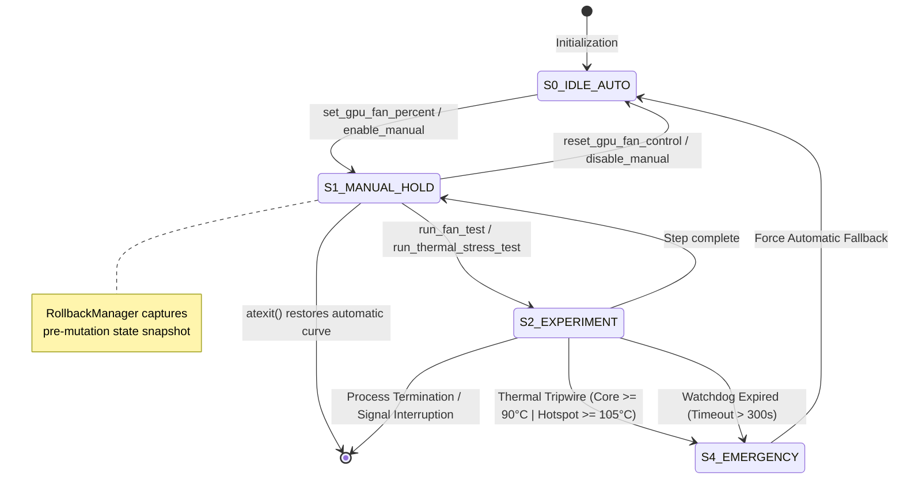

# HWCTL: Hardware Actuation & Telemetry Protocol Specification

**Specification Identifier:** `HWCTL-AGENT-PROTOCOL-V1`  
**Target Consumer:** `Antigravity AI Agent`  
**Host Target Platforms:** `Windows 10/11 x64` | `Linux x86_64 (Arch Linux / Kernel 5.x–6.x)`  
**Target Hardware Family:** `AMD Radeon Architectures (Polaris 10/20 / RX 470/480/570/580)` *(Extensible to NVIDIA NVAPI & Intel ControlLib)*  
**Conformance Language:** Conforms to RFC 2119 (`MUST`, `MUST NOT`, `REQUIRED`, `SHALL`, `SHOULD`, `RECOMMENDED`, `MAY`).

---

## 0. Quickstart — Diagnostic Playbook for the Agent

> **Antigravity**: when you need to diagnose a user's GPU, execute this sequence as your first pass.  
> Every command emits **pure JSON to stdout**. Parse it, correlate, deduce.

```bash
# ── PHASE 0: BOOTSTRAP ──────────────────────────────────────────────
# Step 0.1 — Self-discovery: enumerate every tool available to you
python -m hwctl.cli describe-tools

# Step 0.2 — Environment readiness: privileges, drivers, conflicts
python -m hwctl.cli check-environment

# ── PHASE 1: PASSIVE OBSERVATION (READ-ONLY, ZERO RISK) ────────────
# Step 1.1 — Host context
python -m hwctl.cli get-system-info

# Step 1.2 — GPU identity
python -m hwctl.cli get-gpu-info

# Step 1.3 — Driver stack
python -m hwctl.cli get-gpu-driver-info

# Step 1.4 — VBIOS / firmware identity
python -m hwctl.cli get-gpu-vbios-info

# Step 1.5 — Live sensor snapshot (temp, clocks, power, fan)
python -m hwctl.cli get-gpu-sensors

# Step 1.6 — Dedicated fan telemetry
python -m hwctl.cli get-gpu-fan-status

# Step 1.7 (Linux only) — Kernel ring buffer for amdgpu driver traces
python -m hwctl.cli get-kernel-logs --lines 100

# ── PHASE 2: ACTIVE PROBING (CONTROLLED MUTATIONS, SAFETY-GUARDED) ─
# Step 2.1 — Fan step-response test (idle GPU, measures PWM→RPM)
python -m hwctl.cli run-fan-test --steps 25,50,75,100 --hold 5 --interval 1

# Step 2.2 — Thermal stress test (OpenCL load + sensor sampling)
python -m hwctl.cli run-thermal-stress-test --duration 30 --interval 1

# ── PHASE 3: CONSOLIDATED REPORT ───────────────────────────────────
# Step 3.1 — Atomic snapshot of everything
python -m hwctl.cli create-diagnostic-snapshot

# Step 3.2 — Persist snapshot to disk for historical comparison
python -m hwctl.cli create-diagnostic-report --output logs/diagnostic.json
```

### Decision Rule After Phase 1

If Phase 1 reveals any of the following, **skip Phase 2 entirely** and report to the user:
* `is_admin: false` → Request privilege elevation before any mutation.
* `conflicting_processes` is non-empty → Advise user to terminate conflicting tuning software.
* `fan.rpm: 0` with `fan.control_mode: "auto"` and `temperature_c < 50` → Zero-RPM mode is normal; inform user.

---

## 1. System Model & Operational Division

`hwctl` functions strictly as the **sensory and motor effector layer** for the autonomous agent.

```text
┌────────────────────────────────────────────────────────────────────────┐
│                   ANTIGRAVITY (Cognitive Core)                         │
│  - Hypothesis formation (e.g., PWM signal failure vs VBIOS table lock) │
│  - Experiment design and sequential step scheduling                    │
│  - Empirical sensor correlation and root-cause deduction               │
│  - Rollback decision and reporting                                     │
└───────────────────────────────────┬────────────────────────────────────┘
                                    │ Process Execution via CLI (stdio / JSON)
                                    ▼
┌────────────────────────────────────────────────────────────────────────┐
│                      HWCTL (Sensory-Motor Effector)                    │
│  - Sensor Bus: Polls hardware registers, ADL C-APIs, sysfs/hwmon nodes │
│  - Actuator Bus: Writes PWM duty cycles, toggles auto/manual registers │
│  - Safety Core: Parameter clamps [0, 100], thermal tripwire, watchdog │
│  - Determinism: Pure JSON on stdout; structured typed error schemas    │
│  - Zero Heuristics: MUST NOT perform autonomous diagnostic decisions   │
└────────────────────────────────────────────────────────────────────────┘
```

### Key Principle: Agent as Brain, hwctl as Nervous System

| Responsibility | Owner |
| :--- | :--- |
| **Deciding** what to measure, in what order, under which conditions | Antigravity |
| **Executing** the measurement or mutation and returning raw data | hwctl |
| **Interpreting** sensor correlations and forming diagnoses | Antigravity |
| **Safety enforcement**, parameter clamping, hardware rollback | hwctl |
| **Communicating** findings and recommendations to the human user | Antigravity |

---

## 2. Hardware Topology & Signal Path (AMD Polaris / RX 580)

To avoid false diagnostic deductions, the agent MUST evaluate the hardware control path:

```text
                        ┌───────────────────────────────┐
                        │      Antigravity Agent        │
                        └───────────────┬───────────────┘
                                        │ python -m hwctl.cli
                                        ▼
             ┌─────────────────────────────────────────────────────┐
             │            Platform Driver Bridge                   │
             │   - Windows: atiadlxx.dll (Overdrive5 / OverdriveN) │
             │   - Linux: amdgpu kernel module (/sys/class/drm/)   │
             └──────────────────────────┬──────────────────────────┘
                                        │
                 ┌──────────────────────┴──────────────────────┐
                 ▼                                             ▼
    ┌─────────────────────────┐                   ┌─────────────────────────┐
    │     PowerPlay Table     │                   │ SMC (System Management  │
    │  (VBIOS ROM / PPTables) │                   │       Controller)       │
    └────────────┬────────────┘                   └────────────┬────────────┘
                 │ Static min/target fan curves                │
                 └──────────────────────┬──────────────────────┘
                                        │ Register PWM (0-255 / 0.0-100.0%)
                                        ▼
                        ┌───────────────────────────────┐
                        │  4-Pin Fan Header (Physical)  │
                        ├───────────────────────────────┤
                        │ Pin 1: GND                    │
                        │ Pin 2: +12V DC                │
                        │ Pin 3: TACH (Hall Pulses/RPM) │ ──► hwctl: fan.rpm
                        │ Pin 4: PWM (Target Duty Cycle)│ ◄── hwctl: set_gpu_fan_percent
                        └───────────────────────────────┘
```

### Critical Differentiation: `reported_percent` vs `reported_rpm`
* `reported_percent`: Reflects the **logical PWM register state** written to the GPU controller.
* `reported_rpm`: Reflects the **physical Hall-effect tachometer frequency** detected by the SMC on Pin 3.
* **Invariant:** If `reported_percent` responds dynamically ($25\% \to 100\%$) but `reported_rpm` remains static (e.g. constant $1127 \text{ RPM}$) or $0 \text{ RPM}$, the software layer is intact; failure is isolated to Pin 3/4 continuity, PWM controller IC, or fixed VBIOS tables.

---

## 3. Finite State Machine (FSM) & Lifecycle Guarantees



### Safety Guarantees
1. **Clamp Guard:** Requested fan speeds $\notin [0.0, 100.0]$ are rejected with `SAFETY_VIOLATION` prior to hardware register access.
2. **Rollback Snapshot:** Any mutation stores initial state. If agent terminates or errors occur, `atexit` invokes `reset_gpu_fan_control()`.
3. **Safety Watchdog:** Background thread enforces a strict $300\text{s}$ ceiling on manual overrides.
4. **Thermal Tripwire:** Real-time compute stress aborts in $<100\text{ms}$ if core temp $\ge 90.0^\circ\text{C}$ or hotspot $\ge 105.0^\circ\text{C}$.
5. **Duration Cap:** All test/stress durations are hard-capped at $300\text{s}$. Requests exceeding this trigger `SAFETY_VIOLATION`.
6. **Graceful Shutdown:** `controller.shutdown()` is called in `finally` blocks — stops stress generators, executes pending rollbacks, and releases driver handles.

---

## 4. Platform Runtime Comparison (Windows vs Linux)

The registry automatically resolves the host execution environment:

| Feature / Capability | Windows 10 / 11 x64 Backend | Arch Linux / Linux x86_64 Backend |
| :--- | :--- | :--- |
| **Driver Interface** | AMD Display Library (`atiadlxx.dll` in System32) | Direct Kernel `sysfs` (`/sys/class/drm/card*/device/hwmon/`) |
| **Actuation Mechanism** | `ADL_Overdrive5_FanSpeed_Set` | Write direct raw PWM to `hwmon*/pwm1` and `pwm1_enable=1` |
| **Telemetry Sensor Bus** | ADL Overdrive5 / OverdriveN structs | Read `/sys/.../hwmon*/fan1_input` (RPM), `temp1_input` (mC) |
| **Privilege Requirement** | Windows Administrator Token (UAC elevation) | `root` / `sudo` access (UID 0) |
| **Kernel Ring Buffer** | Windows Event Log (Opaque `ADL_ERR` return codes) | Direct kernel `dmesg` (`get-kernel-logs` captures SMC/I2C traces) |
| **OverDrive Constraints** | Dependent on Adrenalin signature validation | Unlocked globally via kernel boot parameter `amdgpu.ppfeaturemask=0xffffffff` |
| **Daemon Dependence** | **None** (No MSI Afterburner, Adrenalin GUI, or FanControl required) | **None** (No X11, Wayland, or CoreCtrl daemon required) |

---

## 5. Complete Tool Interface Catalog (CLI & JSON Protocol)

All invocations use standard CLI syntax: `python -m hwctl.cli <command> [flags]`.  
`stdout` is strictly reserved for deterministic JSON output. `stderr` contains debug/warning logging.

### Global Flags (Available on Every Command)

| Flag | Type | Default | Description |
| :--- | :--- | :--- | :--- |
| `--provider` | `amd \| nvidia \| intel \| mock` | Auto-detect | Force a specific hardware provider backend |
| `--mock-fault` | `none \| stuck_fan \| no_fan_control` | `none` | Inject a simulated hardware fault (mock provider only) |
| `--adapter` | `int` | `0` | Target GPU adapter index for multi-GPU systems |
| `--json` | `flag` | `true` | Force JSON output (always on by default) |

---

### 5.1 Self-Discovery & Introspection

#### `describe-tools`
* **Invocation:** `python -m hwctl.cli describe-tools`
* **Purpose:** Returns the complete machine-readable tool catalog with every available command, its parameters, types, defaults, and descriptions. The agent SHOULD call this first to discover its own capabilities dynamically.
* **Output Schema:**
```json
{
  "success": true,
  "action": "describe-tools",
  "catalog": {
    "tools": [
      {
        "name": "get_gpu_sensors",
        "description": "Reads real-time GPU sensors (temperatures, clocks, fan RPM/%, power, voltage).",
        "parameters": {
          "adapter": {"type": "integer", "description": "Adapter index (default 0)", "default": 0}
        }
      }
    ]
  }
}
```

---

### 5.2 Environment & System Discovery

#### `check-environment`
* **Invocation:** `python -m hwctl.cli check-environment`
* **Purpose:** Evaluates host OS, elevated privileges, driver access, OpenCL availability, ppfeaturemask (Linux), and process race conditions with conflicting tuning software.
* **Agent Decision Points:**
  - If `is_admin` is `false`: **STOP**. Request user to re-run with Admin/root privileges.
  - If `adl_available` is `false` (Windows): AMD driver may not be installed — inform user.
  - If `conflicting_processes` is non-empty: Warn user that tools like Afterburner or CoreCtrl may silently overwrite fan settings.
* **Output Schema:**
```json
{
  "success": true,
  "action": "check_environment",
  "timestamp": "2026-10-08T22:00:00+00:00",
  "data": {
    "is_admin": true,
    "adl_available": true,
    "opencl_available": true,
    "active_gpu_vendor": "AMD",
    "conflicting_processes": [],
    "notes": [
      "Detected OS: Windows.",
      "Process is running elevated as Administrator."
    ]
  }
}
```

#### `get-system-info`
* **Invocation:** `python -m hwctl.cli get-system-info`
* **Purpose:** Retrieves OS version, CPU model, physical/logical core counts, total/free RAM, motherboard vendor/product (DMI), and a list of relevant running processes with CPU/memory usage and a flag indicating if they are known hardware tuning tools.
* **Output Schema:**
```json
{
  "success": true,
  "action": "get_system_info",
  "timestamp": "2026-10-08T22:00:00+00:00",
  "data": {
    "os_name": "Windows",
    "os_version": "10.0.19045",
    "os_build": "19045",
    "cpu_model": "AMD Ryzen 5 3600 6-Core Processor",
    "cpu_cores_physical": 6,
    "cpu_cores_logical": 12,
    "ram_total_mb": 16384.0,
    "ram_available_mb": 8192.0,
    "motherboard_vendor": "ASUSTeK COMPUTER INC.",
    "motherboard_product": "PRIME B450M-A",
    "relevant_processes": [
      {
        "pid": 4567,
        "name": "MSIAfterburner.exe",
        "cpu_percent": 1.2,
        "memory_mb": 85.0,
        "is_hardware_tool": true
      }
    ]
  }
}
```

#### `get-kernel-logs` *(Linux / Arch Linux Only)*
* **Invocation:** `python -m hwctl.cli get-kernel-logs [--lines 50]`
* **Purpose:** Queries Linux kernel ring buffer (`dmesg`) filtered for `amdgpu` driver entries (SMC message failures, VBIOS checksum mismatches, I2C timeouts, firmware load events).
* **Agent Decision Points:**
  - Search for `"Failed to send message to SMC"` → Indicates VBIOS / SMC communication failure.
  - Search for `"ATOM BIOS"` → Confirms VBIOS identity string.
  - Search for `"I2C"` errors → Possible fan header or thermal sensor communication failure.
* **Output Schema:**
```json
{
  "success": true,
  "action": "get_kernel_logs",
  "timestamp": "2026-10-08T22:00:00+00:00",
  "data": {
    "count": 2,
    "logs": [
      "[   14.201] amdgpu 0000:01:00.0: amdgpu: ATOM BIOS: 113-1E3660U-O51",
      "[   45.102] amdgpu 0000:01:00.0: [powerplay] Failed to send message to SMC (0x12)"
    ]
  }
}
```

---

### 5.3 GPU Telemetry & State Perception

#### `get-gpu-info`
* **Invocation:** `python -m hwctl.cli get-gpu-info [--adapter 0]`
* **Purpose:** Static/semi-static GPU identification — model, vendor, sub-vendor, VRAM, driver version, VBIOS, PCI device ID, power and thermal limits.
* **Output Schema:**
```json
{
  "success": true,
  "action": "get_gpu_info",
  "timestamp": "2026-10-08T22:00:00+00:00",
  "data": {
    "adapter_index": 0,
    "vendor": "AMD",
    "model": "Radeon RX 580 Series",
    "sub_vendor": "Sapphire Technology Limited",
    "vram_mb": 8192,
    "driver_version": "31.0.21912.14",
    "vbios_version": "113-1E3660U-O51",
    "device_id": "0x67DF",
    "power_limit_w": 185.0,
    "thermal_limit_c": 85.0,
    "is_primary": true
  }
}
```

#### `get-gpu-sensors`
* **Invocation:** `python -m hwctl.cli get-gpu-sensors [--adapter 0]`
* **Purpose:** High-resolution real-time sensor snapshot — temperatures (core + hotspot junction), GPU utilization, VRAM utilization, power draw, core/memory clocks, voltage, and full fan state.
* **Output Schema:**
```json
{
  "success": true,
  "action": "get_gpu_sensors",
  "timestamp": "2026-10-08T22:00:00+00:00",
  "data": {
    "temperature_c": 52.0,
    "hotspot_c": 64.5,
    "usage_percent": 15.0,
    "vram_usage_percent": 22.5,
    "vram_used_mb": 1843.0,
    "power_w": 42.0,
    "core_clock_mhz": 1340.0,
    "memory_clock_mhz": 2000.0,
    "voltage_mv": 1150.0,
    "fan": {
      "target_percent": 40.0,
      "current_percent": 40.0,
      "rpm": 1127,
      "control_mode": "auto",
      "min_percent": 0.0,
      "max_percent": 100.0,
      "min_rpm": 0,
      "max_rpm": 3200
    }
  }
}
```

#### `get-gpu-fan-status`
* **Invocation:** `python -m hwctl.cli get-gpu-fan-status [--adapter 0]`
* **Purpose:** Dedicated fan-only telemetry query. Returns target and current percentages, RPM reading, control mode (`auto` / `manual` / `unknown`), and min/max capability ranges.
* **Agent Usage:** Call this **before and after** any fan mutation to verify the write was applied correctly.
* **Output Schema:**
```json
{
  "success": true,
  "action": "get_gpu_fan_status",
  "timestamp": "2026-10-08T22:00:00+00:00",
  "data": {
    "target_percent": 40.0,
    "current_percent": 40.0,
    "rpm": 1127,
    "control_mode": "auto",
    "min_percent": 0.0,
    "max_percent": 100.0,
    "min_rpm": 0,
    "max_rpm": 3200
  }
}
```

#### `get-gpu-driver-info`
* **Invocation:** `python -m hwctl.cli get-gpu-driver-info [--adapter 0]`
* **Purpose:** Queries the driver version string and interface readiness. On Windows, this checks the ADL DLL accessibility. On Linux, this checks sysfs driver paths.
* **Output Schema:**
```json
{
  "success": true,
  "action": "get_gpu_driver_info",
  "timestamp": "2026-10-08T22:00:00+00:00",
  "data": {
    "driver_version": "31.0.21912.14",
    "driver_date": "2024-02-15",
    "interface": "ADL_Overdrive5",
    "status": "ready"
  }
}
```

#### `get-gpu-vbios-info`
* **Invocation:** `python -m hwctl.cli get-gpu-vbios-info [--adapter 0]`
* **Purpose:** Reads the VBIOS/firmware version string from the GPU ROM. Critical for diagnosing PowerPlay table locks and fan curve overrides baked into firmware.
* **Output Schema:**
```json
{
  "success": true,
  "action": "get_gpu_vbios_info",
  "timestamp": "2026-10-08T22:00:00+00:00",
  "data": {
    "vbios_version": "113-1E3660U-O51",
    "vbios_date": "2017-05-10"
  }
}
```

---

### 5.4 Actuators & Safe Mutation

#### `enable-gpu-manual-fan-control`
* **Invocation:** `python -m hwctl.cli enable-gpu-manual-fan-control [--adapter 0]`
* **Purpose:** Switches the GPU fan controller from automatic (VBIOS/driver) mode to manual mode. This is a **prerequisite** for `set-gpu-fan-percent` on some driver configurations. Captures a rollback snapshot.
* **FSM Transition:** `S0_IDLE_AUTO → S1_MANUAL_HOLD`
* **Output Schema:**
```json
{
  "success": true,
  "action": "enable_gpu_manual_fan_control",
  "timestamp": "2026-10-08T22:00:00+00:00"
}
```

#### `set-gpu-fan-percent`
* **Invocation:** `python -m hwctl.cli set-gpu-fan-percent --percent <float: 0.0-100.0> [--adapter 0]`
* **Preconditions:** Process elevated (`root` or Admin). $0.0 \le \text{percent} \le 100.0$.
* **Postconditions:** Registers updated; telemetry sampled immediately and returned in response.
* **Safety:** Captures rollback snapshot on first call. `atexit` handler will restore automatic mode if process terminates.
* **Output Schema:**
```json
{
  "success": true,
  "action": "set_gpu_fan_percent",
  "timestamp": "2026-10-08T22:00:00+00:00",
  "requested_percent": 80.0,
  "reported_percent": 80.0,
  "reported_rpm": 1127,
  "temperature_c": 54.0,
  "power_w": 42.0
}
```

#### `disable-gpu-manual-fan-control`
* **Invocation:** `python -m hwctl.cli disable-gpu-manual-fan-control [--adapter 0]`
* **Purpose:** Restores the driver/firmware automatic fan curve. Clears the rollback manager state.
* **FSM Transition:** `S1_MANUAL_HOLD → S0_IDLE_AUTO`

#### `reset-gpu-fan-control`
* **Invocation:** `python -m hwctl.cli reset-gpu-fan-control [--adapter 0]`
* **Purpose:** **Failsafe reset** — unconditionally restores the default automatic fan curve and clears all active rollback state. Use this as the ultimate recovery action.
* **When to Use:** After any experiment, on any error, or as a final cleanup step.

---

### 5.5 Controlled Experiments & Thermal Workloads

#### `run-fan-test`
* **Invocation:** `python -m hwctl.cli run-fan-test [--steps 25,50,75,100] [--hold 5.0] [--interval 1.0] [--adapter 0]`
* **Purpose:** Executes sequential PWM duty cycle step-test in idle state. At each step, holds the target percentage and samples sensor data at the specified interval. Restores automatic fan curve upon test termination or exception.
* **Agent Interpretation Guide:**
  - Compare `target_percent` vs `final_sensors.fan.rpm` across steps.
  - If RPM **changes proportionally** with target %: fan hardware is healthy.
  - If RPM **stays constant** across all steps: tachometer failure, VBIOS lock, or mechanical issue.
  - If RPM is **0 across all steps**: fan disconnected, seized, or zero-RPM mode active.
* **Output Schema:**
```json
{
  "success": true,
  "action": "run_fan_test",
  "timestamp": "2026-10-08T22:00:00+00:00",
  "data": {
    "success": true,
    "test_name": "gpu_fan_step_test",
    "start_time": "2026-10-08T22:00:00+00:00",
    "end_time": "2026-10-08T22:00:20+00:00",
    "restored_original_state": true,
    "steps": [
      {
        "step_index": 1,
        "target_percent": 25.0,
        "hold_duration_seconds": 5.0,
        "initial_sensors": { "fan": { "rpm": 800, "current_percent": 25.0 }, "temperature_c": 48.0 },
        "final_sensors": { "fan": { "rpm": 820, "current_percent": 25.0 }, "temperature_c": 48.5 },
        "samples_count": 5,
        "samples": [...]
      },
      {
        "step_index": 2,
        "target_percent": 50.0,
        "hold_duration_seconds": 5.0,
        "initial_sensors": { "fan": { "rpm": 820, "current_percent": 50.0 }, "temperature_c": 48.5 },
        "final_sensors": { "fan": { "rpm": 1500, "current_percent": 50.0 }, "temperature_c": 49.0 },
        "samples_count": 5,
        "samples": [...]
      }
    ]
  }
}
```

#### `start-gpu-stress`
* **Invocation:** `python -m hwctl.cli start-gpu-stress [--duration 30.0]`
* **Purpose:** Launches a **background** GPU compute workload (OpenCL / hardware accelerated) that runs asynchronously. The command returns immediately with the stress state. A safety auto-timeout kills the workload after the specified duration.
* **Agent Usage:** Use this when you need to apply GPU load **while independently polling sensors** in a separate call cadence. Pair with `get-gpu-sensors` calls to observe thermal behavior under load.
* **Output Schema:**
```json
{
  "success": true,
  "action": "start_gpu_stress",
  "timestamp": "2026-10-08T22:00:00+00:00",
  "data": {
    "running": true,
    "max_duration_seconds": 30.0,
    "hardware_accelerated": true,
    "sensors_now": { "temperature_c": 52.0, "usage_percent": 98.0, "power_w": 148.0, "fan": { "rpm": 1127 } }
  }
}
```

#### `stop-gpu-stress`
* **Invocation:** `python -m hwctl.cli stop-gpu-stress`
* **Purpose:** Immediately halts any active background GPU compute stress. Returns current sensor state post-halt.
* **Output Schema:**
```json
{
  "success": true,
  "action": "stop_gpu_stress",
  "timestamp": "2026-10-08T22:00:00+00:00",
  "data": {
    "running": false,
    "sensors_now": { "temperature_c": 58.0, "usage_percent": 2.0, "power_w": 25.0, "fan": { "rpm": 1127 } }
  }
}
```

#### `run-thermal-stress-test`
* **Invocation:** `python -m hwctl.cli run-thermal-stress-test [--duration 20.0] [--interval 1.0] [--emergency-temp 90.0] [--emergency-hotspot 105.0] [--adapter 0]`
* **Mechanism:** Dispatches a native OpenCL compute kernel directly to GPU Compute Units (ALUs), establishing $\sim 99\%$ compute load and nominal TDP draw ($\sim 145\text{W}-185\text{W}$). Continuously samples sensor data at the specified interval.
* **Tripwire Behavior:** Aborts workload within $<100\text{ms}$ if `temperature_c >= emergency_temp` or `hotspot_c >= emergency_hotspot`.
* **Difference from `start-gpu-stress`:** This is a **synchronous, self-contained experiment** that blocks until completion and returns a complete time-series dataset. `start-gpu-stress` is **asynchronous** and requires separate sensor polling.
* **Output Schema:**
```json
{
  "success": true,
  "action": "run_thermal_stress_test",
  "timestamp": "2026-10-08T22:00:00+00:00",
  "data": {
    "success": true,
    "duration_seconds": 20.0,
    "aborted_by_safety": false,
    "abort_reason": null,
    "initial_temperature": 50.0,
    "peak_temperature": 82.5,
    "final_temperature": 55.0,
    "initial_rpm": 1127,
    "peak_rpm": 1127,
    "final_rpm": 1127,
    "samples": [
      {
        "elapsed_seconds": 1.0,
        "temperature_c": 56.0,
        "hotspot_c": 68.0,
        "rpm": 1127,
        "fan_percent": 85.0,
        "usage_percent": 99.0,
        "power_w": 148.0
      }
    ]
  }
}
```

---

### 5.6 Diagnostic Snapshots & Reports

#### `create-diagnostic-snapshot`
* **Invocation:** `python -m hwctl.cli create-diagnostic-snapshot [--adapter 0]`
* **Purpose:** Captures a **single, synchronized, atomic snapshot** of the entire system state in one call: system info, GPU info, driver info, VBIOS info, and live sensor data. This is the agent's "take a photo of everything right now" tool.
* **Agent Usage:** Use this as a baseline before experiments, and again after experiments, to compare the before/after state.
* **Output Schema:**
```json
{
  "success": true,
  "action": "create_diagnostic_snapshot",
  "timestamp": "2026-10-08T22:00:00+00:00",
  "data": {
    "timestamp": "2026-10-08T22:00:00+00:00",
    "system": { "os_name": "Windows", "cpu_model": "AMD Ryzen 5 3600", "..." : "..." },
    "gpu": { "vendor": "AMD", "model": "Radeon RX 580 Series", "..." : "..." },
    "driver": { "driver_version": "31.0.21912.14", "..." : "..." },
    "vbios": { "vbios_version": "113-1E3660U-O51" },
    "sensors": { "temperature_c": 52.0, "fan": { "rpm": 1127 }, "..." : "..." }
  }
}
```

#### `create-diagnostic-report`
* **Invocation:** `python -m hwctl.cli create-diagnostic-report [--output logs/diagnostic.json]`
* **Purpose:** Captures a diagnostic snapshot and **persists it as a JSON file** to the specified path (or auto-generates a timestamped filename under `logs/`). Returns both the file path and the snapshot data.
* **Agent Usage:** Use this to create persistent artifacts that survive session boundaries. Reference saved reports for temporal comparison.
* **Output Schema:**
```json
{
  "success": true,
  "action": "create_diagnostic_report",
  "timestamp": "2026-10-08T22:00:00+00:00",
  "data": {
    "file_path": "C:\\Users\\ASUS\\Desktop\\suara\\AntigravitySolverAMD\\logs\\snapshot_1696800000.json",
    "snapshot": { "..." : "..." }
  }
}
```

---

## 6. Empirical Inference Truth Table for Antigravity

Antigravity SHOULD correlate sensory outputs using the following empirical decision matrix:

| $\text{Target}_{\text{PWM}}$ | $\text{Reported}_{\text{PWM}}$ | $\text{Reported}_{\text{RPM}}$ | $\Delta \text{Temp}$ under Load | Deductive Root Cause Hypothesis | Recommended Agent Verification |
| :---: | :---: | :---: | :---: | :--- | :--- |
| $100\%$ | $100\%$ | $\sim 1127$ (Static) | Rápido ($+1.5^\circ\text{C/s}$) | **Hardware Actuation Failure:** Tachometer signal floating, broken PWM lead (Pin 4), or static VBIOS PowerPlay lock. | Run `get-gpu-vbios-info` / inspect `get-kernel-logs` for SMC timeouts. |
| $100\%$ | $100\%$ | $0 \text{ RPM}$ | Rápido ($+1.8^\circ\text{C/s}$) | **Mechanical Seizure:** Fan bearing seized, motor coil burnt, or 4-pin header detached. | Prompt human for physical inspection of fan blades. |
| $100\%$ | $< 50\%$ | Matches | Moderado | **Software Collision:** Background daemon (Afterburner / CoreCtrl) actively overwriting PWM register. | Inspect `conflicting_processes` in `check-environment`. |
| $100\%$ | $100\%$ | $> 2800 \text{ RPM}$ | Elevado ($> 85^\circ\text{C}$) | **Thermal Interface Breakdown:** Fans spin at max RPM but heat is not transferred (dried paste, pump-out, unseated cooler). | Conclude thermal paste degradation. |
| $< 40\%$ | $< 40\%$ | $0 \text{ RPM}$ | Estable ($< 50^\circ\text{C}$) | **Normal Operation:** Zero-RPM firmware feature active below threshold. | Expected behavior. No action needed. |

---

## 7. Advanced Diagnostic Playbooks

### 7.1 Playbook: "Fan Not Responding" Diagnosis

```text
HYPOTHESIS: The user reports the fan doesn't spin or doesn't change speed.

STEP 1: check-environment
  → Is admin? Is ADL/sysfs available? Any conflicting processes?

STEP 2: get-gpu-fan-status
  → Record baseline: control_mode, current_percent, rpm

STEP 3: run-fan-test --steps 0,25,50,75,100 --hold 8 --interval 1
  → Collect RPM response at each PWM step

ANALYZE:
  IF rpm varies proportionally with target_percent:
    → Fan is healthy. User perception may be wrong, or noise threshold is low.

  IF rpm is CONSTANT across all steps (e.g., always 1127 RPM):
    STEP 4a: get-gpu-vbios-info
      → Check if VBIOS has a static fan table (common in mining BIOSes)
    STEP 4b: get-kernel-logs --lines 100 (Linux only)
      → Look for "Failed to send message to SMC"
    CONCLUSION: VBIOS PowerPlay lock or SMC communication failure.

  IF rpm is 0 across all steps AND temperature_c < 50:
    → Zero-RPM mode. Increase temperature to verify:
    STEP 4c: run-thermal-stress-test --duration 15
      → If rpm activates when temp rises: Zero-RPM confirmed. Normal.
      → If rpm stays 0 while temp rises rapidly: Fan is physically disconnected/seized.
        → Prompt user for physical inspection.

CLEANUP: reset-gpu-fan-control (always)
```

### 7.2 Playbook: "GPU Overheating" Diagnosis

```text
HYPOTHESIS: User reports high temperatures or thermal throttling.

STEP 1: create-diagnostic-snapshot
  → Capture baseline state

STEP 2: get-gpu-sensors
  → Record idle temperature (should be 35-55°C)
  → If idle temp > 65°C: possible airflow or paste issue even before stress

STEP 3: run-thermal-stress-test --duration 30 --interval 1
  → Observe temperature ramp rate (°C/s) and fan response

ANALYZE:
  COMPUTE ramp_rate = (peak_temperature - initial_temperature) / time_to_peak

  IF ramp_rate > 1.5°C/s AND peak_rpm > 2500:
    → Thermal interface degraded. Fan is working hard but heat isn't transferring.
    → CONCLUSION: Recommend thermal paste replacement.

  IF ramp_rate > 1.5°C/s AND peak_rpm stays low (< 1500):
    → Fan not ramping up under auto control.
    → STEP 4: Manually set fan to 100%:
      set-gpu-fan-percent --percent 100
    → STEP 5: Re-run stress: run-thermal-stress-test --duration 20
    → If temps are now controlled: auto fan curve is misconfigured.
    → If temps still spike: thermal interface issue.

  IF aborted_by_safety is true:
    → Emergency tripwire triggered. Inform user of critical thermal condition.

CLEANUP: reset-gpu-fan-control (always)
```

### 7.3 Playbook: "Comprehensive Health Check"

```text
PURPOSE: Full system audit. Run when user says "check my GPU" with no specific symptom.

STEP 1: check-environment
STEP 2: create-diagnostic-snapshot (baseline)
STEP 3: run-fan-test --steps 25,50,75,100 --hold 5 --interval 1
STEP 4: run-thermal-stress-test --duration 30 --interval 1
STEP 5: create-diagnostic-snapshot (post-test)
STEP 6: create-diagnostic-report --output logs/health_check.json

REPORT TO USER:
  - Environment status (permissions, drivers, conflicts)
  - GPU identity and firmware
  - Fan response curve (RPM at each PWM step)
  - Thermal behavior under load (ramp rate, peak temp, fan response)
  - Any anomalies detected
  - Saved report location for future reference
```

---

## 8. Error Code Protocol (`HwctlError`)

When execution fails, `stdout` outputs `{"success": false, "error": {"code": "...", "message": "..."}}` with exit code `1`:

| Error Code | Underlying Condition | Autonomous Agent Recovery Action |
| :--- | :--- | :--- |
| `PERMISSION_DENIED` | Non-elevated process (Windows non-Admin or Linux non-root). | Request user privilege elevation (`sudo` / Admin prompt). |
| `SAFETY_VIOLATION` | Parameter outside physical bounds (e.g., fan percent $\notin [0, 100]$, duration > 300s). | Clamp argument to valid range and retry. |
| `FAN_CONTROL_UNAVAILABLE` | Driver rejects write access or Overdrive locked. | Verify driver installation or check VBIOS write protection. |
| `ACTION_TIMEOUT` | Operation exceeded safety time limit (300s ceiling). | Abort step, sample current thermal state, restore defaults. |
| `DRIVER_ERROR` | ADL call returned status code $\ne 0$ or sysfs write failed. | Query `get-kernel-logs` on Linux or check driver state. |
| `HARDWARE_NOT_FOUND` | No compatible GPU detected on bus. | Fall back to `--provider mock` for simulated validation. |
| `INVALID_PARAMETER` | Input parameter failed validation (None, wrong type, out of range). | Correct the parameter value and retry. |
| `FEATURE_UNSUPPORTED` | Specific feature (hotspot temp, RPM, etc.) not supported by hardware/driver. | Skip the unsupported metric and proceed with available data. |
| `EXECUTION_ERROR` | Unclassified runtime error (catch-all). | Log the error message, reset hardware state, and report to user. |

### Error Response Schema

```json
{
  "success": false,
  "action": "set_gpu_fan_percent",
  "error": {
    "code": "SAFETY_VIOLATION",
    "message": "Requested fan speed 150.0% is out of safe range [0.0, 100.0]."
  },
  "timestamp": "2026-10-08T22:00:00+00:00"
}
```

---

## 9. Simulation & Mock Testing Flags

To validate agent reasoning without physical hardware, append `--provider mock` and optional fault injection flags:

```bash
# Nominal RX 580 simulation:
python -m hwctl.cli --provider mock --mock-fault none get-gpu-sensors

# Inject the exact target fault (RPM tachometer locked at 1127 RPM):
python -m hwctl.cli --provider mock --mock-fault stuck_fan run-thermal-stress-test --duration 5

# Inject driver write rejection:
python -m hwctl.cli --provider mock --mock-fault no_fan_control set-gpu-fan-percent --percent 50

# Full diagnostic playbook in mock mode:
python -m hwctl.cli --provider mock check-environment
python -m hwctl.cli --provider mock get-gpu-info
python -m hwctl.cli --provider mock get-gpu-sensors
python -m hwctl.cli --provider mock run-fan-test --steps 25,50,75,100 --hold 3
python -m hwctl.cli --provider mock run-thermal-stress-test --duration 10
python -m hwctl.cli --provider mock create-diagnostic-report
```

---

## 10. Codebase Architecture Reference

```text
hwctl/
├── __init__.py                    # Package metadata (version, description)
├── cli.py                         # Argparse CLI entry point + tool catalog
├── core/
│   ├── controller.py              # HardwareController — central API hub
│   ├── exceptions.py              # Typed exception hierarchy (HwctlError base)
│   ├── logger.py                  # Structured audit logger (JSON events)
│   ├── models.py                  # Dataclass schemas (FanStatus, GpuSensors, etc.)
│   ├── registry.py                # Provider auto-detection & registry
│   └── safety.py                  # SafetyGuard, RollbackManager, SafetyWatchdog
├── experiments/
│   ├── fan_step.py                # FanStepExperiment (multi-step PWM test)
│   └── stress.py                  # GpuStressGenerator + ThermalStressExperiment
├── providers/
│   ├── base.py                    # Abstract base classes (BaseGpuProvider, BaseSystemProvider)
│   ├── amd/
│   │   ├── adl.py                 # Windows ADL DLL bindings (Overdrive5/N)
│   │   ├── linux.py               # Linux sysfs/hwmon direct access
│   │   └── provider.py            # AmdGpuProvider (platform-dispatching facade)
│   ├── nvidia/                    # NVIDIA NVAPI provider (extensible, not yet implemented)
│   ├── intel/                     # Intel ControlLib provider (extensible, not yet implemented)
│   ├── mock/                      # Mock provider with fault injection for testing
│   └── system/                    # OS-level system info provider
├── logs/                          # Diagnostic report output directory
├── tests/                         # Unit + regression test suite (25 tests)
└── pyproject.toml                 # Build config (setuptools, Python >=3.10, psutil dependency)
```

---

## 11. Installation & Dependencies

```bash
# From the project root:
pip install -e .

# Or run directly without install:
python -m hwctl.cli <command>
```

### Runtime Dependencies
| Package | Version | Purpose |
| :--- | :--- | :--- |
| `psutil` | `>=5.9.0` | Process enumeration, CPU/RAM metrics |
| Python stdlib | `>=3.10` | `ctypes` (ADL FFI), `argparse`, `json`, `threading`, `atexit`, `pathlib` |

### Optional (for hardware-accelerated stress tests)
| Package | Purpose |
| :--- | :--- |
| `pyopencl` | GPU compute kernel dispatch for thermal stress tests |

### Privilege Requirements
| Platform | Requirement | Verification |
| :--- | :--- | :--- |
| Windows | Run terminal as **Administrator** | `check-environment` → `is_admin: true` |
| Linux | Run with `sudo` or as `root` | `check-environment` → `is_admin: true` |

---

## 12. Verification & Test Suite

All 25 automated unit and regression tests validate schemas, FSM safety transitions, OpenCL stress dispatch, and platform detection:

```bash
python -m unittest discover tests
```
*Expected Result:* `Ran 25 tests ... OK`
