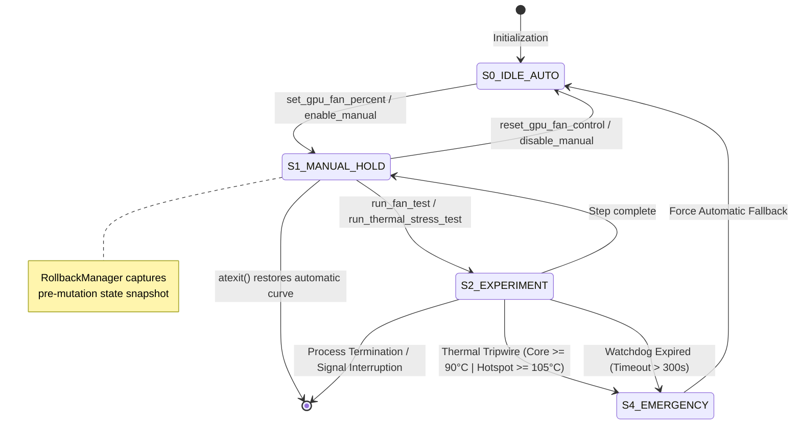

# HWCTL: Hardware Actuation & Telemetry Protocol Specification

**Specification Identifier:** `HWCTL-AGENT-PROTOCOL-V1`  
**Target Consumer:** `Antigravity AI Agent`  
**Host Target Platforms:** `Windows 10/11 x64` | `Linux x86_64 (Arch Linux / Kernel 5.x–6.x)`  
**Target Hardware Family:** `AMD Radeon Architectures (Polaris 10/20 / RX 470/480/570/580)` *(Extensible to NVIDIA NVAPI & Intel ControlLib)*  
**Conformance Language:** Conforms to RFC 2119 (`MUST`, `MUST NOT`, `REQUIRED`, `SHALL`, `SHOULD`, `RECOMMENDED`, `MAY`).

---

## 1. System Model & Operational Division

`hwctl` functions strictly as the **sensory and motor effector layer** for the autonomous agent.

```text
┌────────────────────────────────────────────────────────────────────────┐
│                   ANTIGRAVITY (Cognitive Core)                         │
│  - Hypothesis formation (e.g., PWM signal failure vs VBIOS table lock) │
│  - Experiment design and sequential step scheduling                    │
│  - Empirical sensor correlation and root-cause deduction               │
│  - Rollback decision and reporting                                     │
└───────────────────────────────────┬────────────────────────────────────┘
                                    │ Process Execution via CLI (stdio / JSON)
                                    ▼
┌────────────────────────────────────────────────────────────────────────┐
│                      HWCTL (Sensory-Motor Effector)                    │
│  - Sensor Bus: Polls hardware registers, ADL C-APIs, sysfs/hwmon nodes │
│  - Actuator Bus: Writes PWM duty cycles, toggles auto/manual registers │
│  - Safety Core: Parameter clamps [0, 100], thermal tripwire, watchdog │
│  - Determinism: Pure JSON on stdout; structured typed error schemas    │
│  - Zero Heuristics: MUST NOT perform autonomous diagnostic decisions   │
└────────────────────────────────────────────────────────────────────────┘
```

---

## 2. Hardware Topology & Signal Path (AMD Polaris / RX 580)

To avoid false diagnostic deductions, the agent MUST evaluate the hardware control path:

```text
                        ┌───────────────────────────────┐
                        │      Antigravity Agent        │
                        └───────────────┬───────────────┘
                                        │ python -m hwctl.cli
                                        ▼
             ┌─────────────────────────────────────────────────────┐
             │            Platform Driver Bridge                   │
             │   - Windows: atiadlxx.dll (Overdrive5 / OverdriveN) │
             │   - Linux: amdgpu kernel module (/sys/class/drm/)   │
             └──────────────────────────┬──────────────────────────┘
                                        │
                 ┌──────────────────────┴──────────────────────┐
                 ▼                                             ▼
    ┌─────────────────────────┐                   ┌─────────────────────────┐
    │     PowerPlay Table     │                   │ SMC (System Management  │
    │  (VBIOS ROM / PPTables) │                   │       Controller)       │
    └────────────┬────────────┘                   └────────────┬────────────┘
                 │ Static min/target fan curves                │
                 └──────────────────────┬──────────────────────┘
                                        │ Register PWM (0-255 / 0.0-100.0%)
                                        ▼
                        ┌───────────────────────────────┐
                        │  4-Pin Fan Header (Physical)  │
                        ├───────────────────────────────┤
                        │ Pin 1: GND                    │
                        │ Pin 2: +12V DC                │
                        │ Pin 3: TACH (Hall Pulses/RPM) │ ──► hwctl: fan.rpm
                        │ Pin 4: PWM (Target Duty Cycle)│ ◄── hwctl: set_gpu_fan_percent
                        └───────────────────────────────┘
```

### Critical Differentiation: `reported_percent` vs `reported_rpm`
* `reported_percent`: Reflects the **logical PWM register state** written to the GPU controller.
* `reported_rpm`: Reflects the **physical Hall-effect tachometer frequency** detected by the SMC on Pin 3.
* **Invariant:** If `reported_percent` responds dynamically ($25\% \to 100\%$) but `reported_rpm` remains static (e.g. constant $1127 \text{ RPM}$) or $0 \text{ RPM}$, the software layer is intact; failure is isolated to Pin 3/4 continuity, PWM controller IC, or fixed VBIOS tables.

---

## 3. Finite State Machine (FSM) & Lifecycle Guarantees



### Safety Guarantees
1. **Clamp Guard:** Requested fan speeds $\notin [0.0, 100.0]$ are rejected with `SAFETY_VIOLATION` prior to hardware register access.
2. **Rollback Snapshot:** Any mutation stores initial state. If agent terminates or errors occur, `atexit` invokes `reset_gpu_fan_control()`.
3. **Safety Watchdog:** Background thread enforces a strict $300\text{s}$ ceiling on manual overrides.
4. **Thermal Tripwire:** Real-time compute stress aborts in $<100\text{ms}$ if core temp $\ge 90.0^\circ\text{C}$ or hotspot $\ge 105.0^\circ\text{C}$.

---

## 4. Platform Runtime Comparison (Windows vs Linux)

The registry automatically resolves the host execution environment:

| Feature / Capability | Windows 10 / 11 x64 Backend | Arch Linux / Linux x86_64 Backend |
| :--- | :--- | :--- |
| **Driver Interface** | AMD Display Library (`atiadlxx.dll` in System32) | Direct Kernel `sysfs` (`/sys/class/drm/card*/device/hwmon/`) |
| **Actuation Mechanism** | `ADL_Overdrive5_FanSpeed_Set` | Write direct raw PWM to `hwmon*/pwm1` and `pwm1_enable=1` |
| **Telemetry Sensor Bus** | ADL Overdrive5 / OverdriveN structs | Read `/sys/.../hwmon*/fan1_input` (RPM), `temp1_input` (mC) |
| **Privilege Requirement** | Windows Administrator Token (UAC elevation) | `root` / `sudo` access (UID 0) |
| **Kernel Ring Buffer** | Windows Event Log (Opaque `ADL_ERR` return codes) | Direct kernel `dmesg` (`get-kernel-logs` captures SMC/I2C traces) |
| **OverDrive Constraints** | Dependent on Adrenalin signature validation | Unlocked globally via kernel boot parameter `amdgpu.ppfeaturemask=0xffffffff` |
| **Daemon Dependence** | **None** (No MSI Afterburner, Adrenalin GUI, or FanControl required) | **None** (No X11, Wayland, or CoreCtrl daemon required) |

---

## 5. Tool Interface Catalog (CLI & JSON Protocol)

All invocations use standard CLI syntax: `python -m hwctl.cli <command> [flags]`.  
`stdout` is strictly reserved for deterministic JSON output. `stderr` contains debug/warning logging.

### 5.1 Environment & System Discovery

#### `check-environment`
* **Invocation:** `python -m hwctl.cli check-environment`
* **Purpose:** Evaluates host OS, elevated privileges, driver access, and process race conditions.
* **Output Schema:**
```json
{
  "success": true,
  "action": "check_environment",
  "data": {
    "is_admin": true,
    "adl_available": false,
    "opencl_available": true,
    "active_gpu_vendor": "AMD",
    "conflicting_processes": ["corectrl"],
    "notes": [
      "Detected OS: Arch Linux (Kernel 6.12.1-arch1-1).",
      "Arch Linux detected: provides maximum freedom via direct sysfs/hwmon nodes and dmesg.",
      "Running as root (UID 0): direct PWM writing and hardware overrides are fully authorized."
    ]
  }
}
```

#### `get-kernel-logs` *(Linux / Arch Linux Only)*
* **Invocation:** `python -m hwctl.cli get-kernel-logs [--lines 50]`
* **Purpose:** Queries Linux kernel ring buffer (`dmesg`) filtered for `amdgpu` driver entries (SMC message failures, VBIOS checksum mismatches, I2C timeouts).
* **Output Schema:**
```json
{
  "success": true,
  "action": "get_kernel_logs",
  "data": {
    "count": 2,
    "logs": [
      "[   14.201] amdgpu 0000:01:00.0: amdgpu: ATOM BIOS: 113-1E3660U-O51",
      "[   45.102] amdgpu 0000:01:00.0: [powerplay] Failed to send message to SMC (0x12)"
    ]
  }
}
```

#### `get-system-info`
* **Invocation:** `python -m hwctl.cli get-system-info`
* **Purpose:** Retrieves OS version, CPU topology, physical/logical core counts, total/free RAM, and motherboard DMI vendor/product.

---

### 5.2 GPU Telemetry & State Perception

#### `get-gpu-info`
* **Invocation:** `python -m hwctl.cli get-gpu-info [--adapter 0]`
* **Output Schema:**
```json
{
  "success": true,
  "action": "get_gpu_info",
  "data": {
    "adapter_index": 0,
    "vendor": "AMD",
    "model": "Radeon RX 580 Series",
    "sub_vendor": "Sapphire Technology Limited",
    "vram_mb": 8192,
    "driver_version": "31.0.21912.14",
    "vbios_version": "113-1E3660U-O51",
    "power_limit_w": 185.0,
    "thermal_limit_c": 85.0,
    "is_primary": true
  }
}
```

#### `get-gpu-sensors`
* **Invocation:** `python -m hwctl.cli get-gpu-sensors [--adapter 0]`
* **Purpose:** High-resolution real-time sensor snapshot.
* **Output Schema:**
```json
{
  "success": true,
  "action": "get_gpu_sensors",
  "data": {
    "temperature_c": 52.0,
    "hotspot_c": 64.5,
    "usage_percent": 15.0,
    "vram_usage_percent": 22.5,
    "vram_used_mb": 1843.0,
    "power_w": 42.0,
    "core_clock_mhz": 1340.0,
    "memory_clock_mhz": 2000.0,
    "voltage_mv": 1150.0,
    "fan": {
      "target_percent": 40.0,
      "current_percent": 40.0,
      "rpm": 1127,
      "control_mode": "auto",
      "min_percent": 0.0,
      "max_percent": 100.0,
      "min_rpm": 0,
      "max_rpm": 3200
    }
  }
}
```

---

### 5.3 Actuators & Safe Mutation

#### `set-gpu-fan-percent`
* **Invocation:** `python -m hwctl.cli set-gpu-fan-percent --percent <float: 0.0-100.0> [--adapter 0]`
* **Preconditions:** Process elevated (`root` or Admin). $0.0 \le \text{percent} \le 100.0$.
* **Postconditions:** Registers updated; telemetry sampled immediately.
* **Output Schema:**
```json
{
  "success": true,
  "action": "set_gpu_fan_percent",
  "requested_percent": 80.0,
  "reported_percent": 80.0,
  "reported_rpm": 1127,
  "temperature_c": 54.0,
  "power_w": 42.0
}
```

#### `reset-gpu-fan-control`
* **Invocation:** `python -m hwctl.cli reset-gpu-fan-control [--adapter 0]`
* **Purpose:** Restores standard driver/VBIOS automatic fan curve. Clears active rollback snapshot.

---

### 5.4 Controlled Experiments & Thermal Workloads

#### `run-fan-test`
* **Invocation:** `python -m hwctl.cli run-fan-test [--steps 25,50,75,100] [--hold 5.0] [--interval 1.0]`
* **Purpose:** Executes sequential PWM duty cycle step-test in idle state. Restores automatic fan curve upon test termination or exception.
* **Output Schema:**
```json
{
  "success": true,
  "action": "run_fan_test",
  "data": {
    "success": true,
    "test_name": "gpu_fan_step_test",
    "restored_original_state": true,
    "steps": [
      {
        "step_index": 1,
        "target_percent": 25.0,
        "hold_duration_seconds": 3.0,
        "initial_sensors": { "fan": { "rpm": 1127, "current_percent": 25.0 } },
        "final_sensors": { "fan": { "rpm": 1127, "current_percent": 25.0 } },
        "samples_count": 3,
        "samples": [...]
      }
    ]
  }
}
```

#### `run-thermal-stress-test`
* **Invocation:** `python -m hwctl.cli run-thermal-stress-test [--duration 20.0] [--interval 1.0] [--emergency-temp 90.0] [--emergency-hotspot 105.0]`
* **Mechanism:** Dispatches a native OpenCL compute kernel directly to GPU Compute Units (ALUs), establishing $\sim 99\%$ compute load and nominal TDP draw ($\sim 145\text{W}-185\text{W}$).
* **Tripwire Behavior:** Aborts workload within $<100\text{ms}$ if `temperature_c >= emergency_temp` or `hotspot_c >= emergency_hotspot`.
* **Output Schema:**
```json
{
  "success": true,
  "action": "run_thermal_stress_test",
  "data": {
    "success": true,
    "duration_seconds": 20.0,
    "aborted_by_safety": false,
    "abort_reason": null,
    "initial_temperature": 50.0,
    "peak_temperature": 82.5,
    "final_temperature": 55.0,
    "initial_rpm": 1127,
    "peak_rpm": 1127,
    "final_rpm": 1127,
    "samples": [
      {
        "elapsed_seconds": 1.0,
        "temperature_c": 56.0,
        "hotspot_c": 68.0,
        "rpm": 1127,
        "fan_percent": 85.0,
        "usage_percent": 99.0,
        "power_w": 148.0
      }
    ]
  }
}
```

---

## 6. Empirical Inference Truth Table for Antigravity

Antigravity SHOULD correlate sensory outputs using the following empirical decision matrix:

| $\text{Target}_{\text{PWM}}$ | $\text{Reported}_{\text{PWM}}$ | $\text{Reported}_{\text{RPM}}$ | $\Delta \text{Temp}$ under Load | Deductive Root Cause Hypothesis | Recommended Agent Verification |
| :---: | :---: | :---: | :---: | :--- | :--- |
| $100\%$ | $100\%$ | $\sim 1127$ (Static) | Rápido ($+1.5^\circ\text{C/s}$) | **Hardware Actuation Failure:** Tachometer signal floating, broken PWM lead (Pin 4), or static VBIOS PowerPlay lock. | Run `dump_vbios` / inspect `get-kernel-logs` for SMC timeouts. |
| $100\%$ | $100\%$ | $0 \text{ RPM}$ | Rápido ($+1.8^\circ\text{C/s}$) | **Mechanical Seizure:** Fan bearing seized, motor coil burnt, or 4-pin header detached. | Prompt human for physical inspection of fan blades. |
| $100\%$ | $< 50\%$ | Matches | Moderado | **Software Collision:** Background daemon (Afterburner / CoreCtrl) actively overwriting PWM register. | Inspect `conflicting_processes` in `check-environment`. |
| $100\%$ | $100\%$ | $> 2800 \text{ RPM}$ | Elevado ($> 85^\circ\text{C}$) | **Thermal Interface Breakdown:** Fans spin at max RPM but heat is not transferred (dried paste, pump-out, unseated cooler). | Conclude thermal paste degradation. |
| $< 40\%$ | $< 40\%$ | $0 \text{ RPM}$ | Estable ($< 50^\circ\text{C}$) | **Normal Operation:** Zero-RPM firmware feature active below threshold. | Expected behavior. No action needed. |

---

## 7. Error Code Protocol (`HwctlError`)

When execution fails, `stdout` outputs `{"success": false, "error": {"code": "...", "message": "..."}}` with exit code `1`:

| Error Code | Underlying Condition | Autonomous Agent Recovery Action |
| :--- | :--- | :--- |
| `PERMISSION_DENIED` | Non-elevated process (Windows non-Admin or Linux non-root). | Request user privilege elevation (`sudo` / Admin prompt). |
| `SAFETY_VIOLATION` | Parameter outside physical bounds (e.g., fan percent $\notin [0, 100]$). | Clamp argument to valid range and retry. |
| `FAN_CONTROL_UNAVAILABLE` | Driver rejects write access or Overdrive locked. | Verify driver installation or check VBIOS write protection. |
| `ACTION_TIMEOUT` | Operation exceeded safety time limit. | Abort step, sample current thermal state, restore defaults. |
| `DRIVER_ERROR` | ADL call returned status code $\ne 0$ or sysfs write failed. | Query `get-kernel-logs` on Linux or check driver state. |
| `HARDWARE_NOT_FOUND` | No compatible GPU detected on bus. | Fall back to `--provider mock` for simulated validation. |

---

## 8. Simulation & Mock Testing Flags

To validate agent reasoning without physical hardware, append `--provider mock` and optional fault injection flags:

```bash
# Nominal RX 580 simulation:
python -m hwctl.cli --provider mock --mock-fault none get-gpu-sensors

# Inject the exact target fault (RPM tachometer locked at 1127 RPM):
python -m hwctl.cli --provider mock --mock-fault stuck_fan run-thermal-stress-test --duration 5

# Inject driver write rejection:
python -m hwctl.cli --provider mock --mock-fault no_fan_control set-gpu-fan-percent --percent 50
```

---

## 9. Verification & Test Suite

All 25 automated unit and regression tests validate schemas, FSM safety transitions, OpenCL stress dispatch, and platform detection:

```bash
python -m unittest discover tests
```
*Expected Result:* `Ran 25 tests ... OK`
